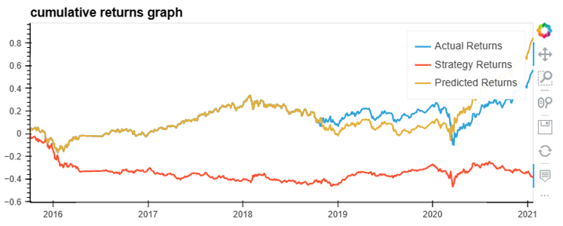

# Machine Learning Trading Bot

## Overview
The purpose of this challenge is to improve the existing algorithmic trading systems and maintain a competitive advantage in the marketplace. To do so, determine which model was the most effective at predicting stock returns for the given dataset.
We can get OHLCV dataset from Quandl and use it to complete the follow steps:

* Establish a Baseline Performance 
   - using the `SVC` classifier model
* Tune the Baseline Trading Algorithm 
   - increase the size of the training dataset
   - increase both the short-window and long-window for the algorithm
* Evaluate a New Machine Learning Classifier
   - CalibratedClassifierCV
* Create an Evaluation Report
   - support findings using test results
   
## Installation

This project leverages Python 3.9 with the following packages:

+ pandas
+ numpy
+ hvplot
+ scikit-learn
+ matplotlib

## Baseline

The baseline machine learning model provided by this challenge gives us a starting point in which to compare future results. (All models use random_state = 1 for consitancy)

**Baseline Performance using the `SVC` classifier model:**

               precision    recall  f1-score   support

        -1.0       0.43      0.04      0.07      1804
         1.0       0.56      0.96      0.71      2288

    accuracy                           0.55      4092
    

  * The accuracy score for the SVC model is 0.55, meaning the model accurately predicted the direction of 55% of stock prices for this test dataset.
 

  * According to the plot, the SVM model performed well and was able to slighly outperform the market. 

**Baseline Trading Algorithm - enlargd training dataset (6 Month):**
                 
                precision    recall  f1-score   support

        -1.0       0.44      0.02      0.04      1732
         1.0       0.56      0.98      0.71      2211

    accuracy                           0.56      3943
   

  For the tuned algorithm with a larger training dataset, we can see that 
  * the accuracy has slightly increased to 0.56 compared to the baseline SVC model. 
  

  * Although the accuracy of the model increased there was little change to the model performance
  
  
**Tune the Baseline Trading Algorithm - larger SMA windows (Short=50, Long=200):**

              precision    recall  f1-score   support

        -1.0       0.00      0.00      0.00      1694
         1.0       0.56      1.00      0.72      2161

    accuracy                           0.56      3855
    
  
  For the tuned algorithm with larger short window and long window, we can see that 
  * The accuracy of this model was also 56%, 1% higher than the SVC model. 

  * However, the model had a 0% accuracy when calculating -1 results. Because of this the model is not reliable. 
  

  
**Apply original parameters to a second machine learning model - CalibratedClassifierCV:**

              precision    recall  f1-score   support

        -1.0       0.43      0.35      0.39      1804
         1.0       0.56      0.64      0.59      2288

    accuracy                           0.51      4092
    
  * The accuracy of the calibrated classifier model was worse than the Baseline SVC model. 
  * However, the model had higher recall anf f1-scores for -1 percission. As a result we can see that the model actually peforms well during the market dip, but lags during the market recovery.
  

  
## Summary

By increasing the size of the training dataset from 3 months to 6 months, we were able to better fit the SVC model and incraese it's accuracy. This resulted in a higher cumulative, 84.17% compared to the base model of 51.76%. 
